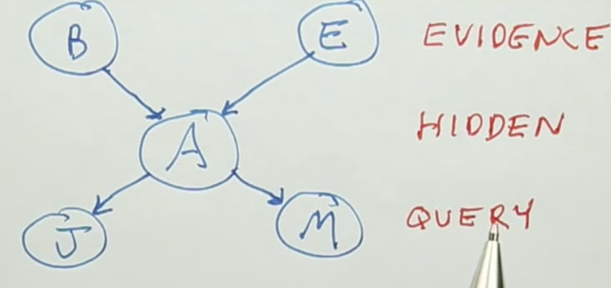

Lesson 4

---

# Probabilistic Inference

## Overview

In probabilistic inference, the inputs of a Bayes Network are referred to as **evidence variables** and the outputs are referred to as **query variables**. Something that is neither evidence nor query is a **hidden variable**



Query variables are not defined by a single value, but rather by a distribution of values, referred to as the posterior distribution:

```
P(Q1, Q2 ... | E1 = e1, E2 = e2, ...)
```

The probability max is also of interest, which is the outcome with the highest likelihood of occurring:

```
argmax_q_P(Q1 = q1, Q2 = q2 ... | E1 = e1, E2 = e2, ...)
```

An interesting component of Bayesian mathematics to note is that unlike functions in ordinary programing languages, the flow is not necessarily one way. The query variables could be flipped to be the evidence, and vice versa.

## Enumeration

The probability of an outcome of a Bayes network can be determined by enumerating over the hidden variables, and summing up values for all possibilities of said hidden variables.

While effective, this method is slow, so the following tricks are applied to speed up the process:

- pulling out terms from the sum
- maximizing independence

For these reasons, inference is easier on Bayes networks when they are written in the causal direction: when the networks flow from causes to effects

## Variable elimination

Works faster than enumeration in most cases. For example, take the following system:

```
raining (r) -> traffic (t) -> late (l)
```

The probability of being late (`P(+l)`) could be enumerated over:

```
P(+l) = ∑r ∑t P(r)P(t|r)P(+l|t)
```

But, variable elimination is a better option, even though enumeration is straightforward in such a small network. The steps to variable elimination are as follows (via "Joining Factors"):

- Taking probability tables and combining them into a single, joint probability table, for example taking the `P(r)` and `P(t|r)` tables and making one `P(r,t)` table
- The joint probability table can then be boiled down into an even simpler table, in this case `P(t)`, created by summing together the values from the joint probability table involving `⌐t` and `t`, respectively
- This is then continued down the chain until only one table is had

## Approximate Interference Sampling

Performing an experiment many times to estimate the probability of specific outcomes. This has advantages over exact inference, as approximate inference is typically simple whereas exact inference can sometimes be very complex. Also has issues when the probability being sought cannot be sampled.

## Rejection Sampling

When looking for a conditional probability, throw out samples that don't match what is being looked for. Problems arise with this method if the sought after values of the given variables are very infrequent, as many samples may have to be gone through before achieving the desired results. Has issues when the probability being sought cannot be sampled.

## Likelihood Weighting

Generates samples in a manner such that none have to be thrown out. This is done by fixing one or more variables, and then sampling the rest. The problem with the generated set is that the probabilities are inconsistent, unlike those generated via approximate interference sampling and rejection sampling. This can be accounted for by assigning probabilistic weights to each generated sample based on the likelihood of it occurring. The weight is selected based on the probability of the value the variable is being fixed to occurring. For example, if A and B are fixed to be positive, and `P(+A)` is 0.5 and `P(+B)` is 0.5, then the weight is the product of the two values, so 0.25. Likelihood weighting has issues when all children of a node are fixed, as that node no longer affects the outcome of nodes further downstream. Thus, if the selected child values are improbable, all weights will be very small.

## Gibbs Sampling

Using a technique called Markov Chain Monte Carlo (MCMC) to take all nodes into account when sampling, rather than just upstream nodes. In Gibbs sampling, all evidence variables are resampled individually, at random, based on the values of the other variables. Unlike the above sampling methods, where each sample was independent of each other, the samples generated via Gibbs sampling are dependent on each other.

## Monty Hall Problem

AN interesting problem showcasing that the number of options does not correlate exactly to the probability of each choice occurring. In the problem, there are 3 doors, 2 with an undesirable prize, and 1 with a good prize. Upon selecting a door, one of the remaining doors (always one with a bad prize), is opened, and you are given the opportunity to change doors. The probability that your original choice was correct is 1/3, since there were 3 choices available when you selected, but the probability of the other door containing the good prize is 2/3. This is because you now have additional information (since the door was opened) that this door is potentially not a bad prize.
