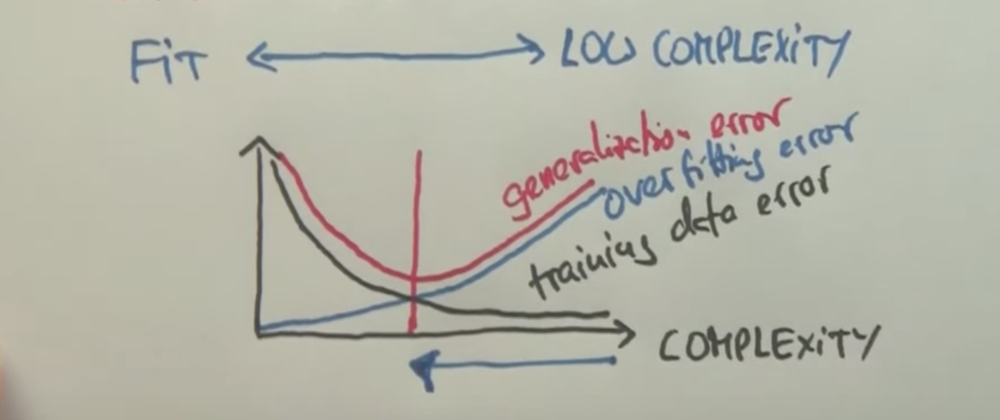

Lesson 5

---

# Machine Learning

## Overview

Machine learning address the problem of how to find and build a Bayes network model based on data.

Machine learning = learn model from data.

Various types of machine learning, but two of the main areas are:

- Supervised machine learning
- Unsupervised machine learning

- **What can be learned?**
    - parameters
    - structure
    - hidden concepts
- **What from?**
    - In supervised learning, target labels (essentially define what information is important) are given for a dataset
    - In unsupervised learning, these labels must be generated internally by the intelligence agent using replacement principles
    - reinforcement; based on an action, the environment's reaction can help reinforce whether or not an action that was performed was "correct"
- **What for?**
    - prediction
    - diagnostics
    - summarize
    - and more
- **How does the machine learn?**
    - passive (the machine cannot affect the environment)
    - active (the machine can affect the environment)
    - online (while the data is being generated)
    - offline (after the data has been generated)
- **Machine learning outputs?**
    - classification (discrete)
    - regression (continuous)
- **Details?**
    - generalative (seeks to model the data as generally as possible)
    - discriminative (seeks to distinguish the data)

## Supervised Learning

The machine learning approach used most often.

For each training example, we are given a training vector and a target label:

```
x_1, x_2 ... x_n -> y
```

The data for supervised machine learning takes a shape similar to the following matrix:

```
[
    x_11, x_12 ... x_1n -> y_1,
    x_21, x_22 ... x_2n -> y_2,
    ...
    x_m1, x_m2 ... x_mn -> y_m,
]
```

Where each input vector is referred to as x_m, we wish for the intelligence agent to come up with a function f such that:

```
f(x_m) = y_m
```

Obviously, an exact match is usually not possible but the purpose of the agent is to get as close as possible.

## Occam's Razor

Everything else being equal, choose the least complex hypothesis. For example, if a linear relationship fits a set of data as well as a trinomial, the linear model is preferable.

This leads to the question of trade off between fit and complexity; typically, it is a decaying exponential relationship between the two, meaning that the more complex a solution becomes, the better it can fit a data set of training data. However, the "generalization error" starts by decreasing with complexity, but then starts to increase, as the more specific a solution, the less likely it is to apply to new data. Thus, there is an ideal compromise between fit and complexity that puts us somewhere in the middle:



Overfitting is a major source of poor performance in machine learning algorithms.

## Spam Detection

Spam detection is a good example of why overfitting is bad.

A spam detection AI wishes to classify emails into two categories: spam, and what is referred to as ham (not spam). In order to begin classification of emails, they need to be quantified somehow. One common approach is called "Bag of Words", which is essentially a map of each word in the email along with its occurence count.

Thus, this dataset can be modeled by a Bayes network where the classification of an email is unobservable, and each word in the email is a query variable. Based on whether or not the email is spam, the probability of certain words occurring will change.

## Laplace Smoothing

When determining probabilities solely from data, overfitting will often occur. In the example of spam detection, assume we want to determine the likelihood that a message was spam. If there was a word that appeared in the message that appeared in no spam messages, then the probability of that message being spam would be 0, regardless of the other words in the message. This is where Laplace smoothing comes in:

```
// standard maximum likelihood estimate
ML  ->  p(x) = count(x) / N

// Laplace estimate (notice "k")
LS(k)   ->  p(x) = (count(x) + k) / (N + k|x|)
```

The denominator of `LS(k)` means `N` plus `k` times the number of classes for `x`

## Summary of Naive Bayes

A naive Bayes model  is built based features of documents x, labels (classifications) y, and a simple Bayesian network. In the example of spam, the features of the documents were the words, and the labels were spam and ham. Maximum likelihood and Laplacian smoothing are then used to determine the probability of particular outcomes.

Naive Bayes is often used in conjunction with other techniques to determine the likelihood of an occurrence. In the example of spam, additional factors such as IP addresses, email text being in all caps, etc. are also considered.

## Overfitting Prevention vis Cross Validation

In order to prevent overfitting, it is important to find an appropriate `k` value for Laplace smoothing. A common way of doing this is to break the training data into 3 sets:

- train (80%)
- cross validation (10%)
- test (10%)

The training data is used to find the parameters, and it is then compared against the cross validation data to determine an appropriate `k`. Once a k is find, it is run against the test data once to acquire a final performance metric. This prevents overfitting to the test data.

## Regression Problems in Supervised Learning

### Linear Regression

When performing linear regression, the quadratic loss needs to be minimized across all training examples:

```
f(x) = w1x + w0

quadratic_loss = ∑_j (y_j - w1x_j - w0)^2
```

### Minimizing Quadratic Loss

The derivation of minimizing the above equation yields 2 key equations (where `M` is the number of data points):

```
w_0 = 1/M * ∑y_i - w_1/M * ∑x_i
w_1 = (M * ∑x_i * y_i - ∑x_i * ∑y_i) / (M * ∑x_i^2 - (∑x_i)^2)
```

### Problems with Linear Regression

Linear regression breaks down when:

- the data is not approximately linear
- there are outliers
- as x goes to infinity y goes to infinity in a linear model, which is often improbable (for example, rising temperatures; the temperature will never become infinite)
    - logistic regression solves some of these issues, see next section

### Logistic Regression

Logistic regression is often a more feasible model than linear regression, as it levels out as it gets closer to ∞ and -∞, but is nearly linear around `x = 0`:

```
z = 1 / (1 + e^(-f(x)))
```

### Gradient Descent

Minimizing complex loss functions typically requires iterative methods, such as gradient descent.

### Perceptron Algorithm

A very early model of a neuron, where classification is binary based on a linear separator:

```
f(x) {
    1 if w_1 * x + w_0 >= 0
    0 if w_1 * x + w_0 < 0
}
```

Perceptron only converges if the data is linear separable.

Similar to gradient descent, is an iterative algorithm

The margin of a linear separator is the distance to the closest training example; the "best" linear separator maximizes the margin.

Algorithms for maximizing margin:

- supportvector machines (SVMs)
    - focuses on creating additional coordinate axes in order to manipulate the data into being linearly separable. This allows for things like circles to be used
- boosting
    - the course didn't go into this

### Linear Methods Summary

- Regression (continuous) vs classification (discrete)
- Exact solutions vs iterative solutions
- Smoothing
- Non-linear problems

## K Nearest Neighbors

In supervised learning, there are two main classifications for learning methods:

- parametric
    - all methods previously discussed fall into this category
    - number of parameters is independent of training set size
- non-parametric
    - k nearest neighbors
    - number of parameters can grow over time with training set

K nearest neighbors method:

- learning: memorize all data
- label new examples
    - find k nearest neighbors
    - return majority class labels
- k is a regularizer that controls the complexity of the k nearest neighbor algorithm; the larger the k, the smoother the output will be

Problems with KNN:

- very large datasets result in long search times
    - there are methods to mitigate this issue via efficient search methods, such as using search trees
- very large feature spaces
    - categorizing based on nearest neighbors becomes increasingly difficult to due spread of choices
