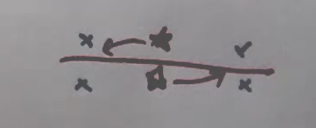

# Unsupervised Learning

## Overview

- In unsupervised learning, the AI is only given data, and no labels or classifications.
- Thus, unsupervised AIs attempt to find structure within the data, which is called density estimation
    - This is often done by identifying clusters, dimensionality reduction, etc.

## Terminology

- Unsupervised learning assumes the data is **IDD**, identically distributed and independently drawn
- **Clustering** is the most basic form of unsupervised learning
    - Commonly used cluster algorithms include:
        - k-means
        - expectation maximization (a probabilistic determination of k-means)

## K-Means Clustering

Steps of k-means clustering:

1. Randomly assign cluster centers
2. Find a sufficient separator between the cluster centers by maximizing the margin between them
3. Move the cluster centers to be centered between the data points on their side of the separator
4. Repeat the process until the cluster centers are adequately positioned, eg. when there is no change in the position of the centers between iterations

Psuedocode k-means algorithm:

```
Initially: select k cluster centers at random
Repeat:
    Correspond data points to nearest cluster center
    Update center by mean of corresponding data points
    stop when no change
```

K-means is known to converge to a locally optimally solution

Problems with k-means:

- need to know k
- lack of a mathematical basis
- high dimensionality of the space (this is a general problem with machine learning, the k-nearest neighbor algorithm of supervised learning suffers from similar issues)
- local minima can cause issues; for example, in the image below, where the cluster centers will not move even though they are not optimally positioned


## Expectation Maximization

Guassians, or normal distributions are described by the following equation:

```
1/(sqrt(2π) * σ) * e^(-1/2 * (x - μ)^2 / σ^2)
```

where `μ` is the mean (and also the peak) and `σ` is the standard deviation (variance)

The area underneath the curve of any probability density function is 1

the probability of a value falling between a and b is the area of the bar formed between the two variables and up to the curve

Guassians can also be multivariate (area still adds to 1):


Where `N` is the number of dimensions and `T` means transpose (**how can this be computed? What does it mean?**)

Remember, correspondence between data points and cluster centers in expectation maximization is always soft. So, unlike k-means where each point corresponds to a specific cluster, every point corresponds to every cluster in EM; the strength of the correspondence simply varies.

**Is EM always radial? Basically, since correspondence is between all points in the form of a gradient**

## Guassian learning

fitting a Guassian to a given set of data

The ideal mean for a given set of data will be the average of the data points, and the average variance will be the average deviate from the mean:


## Expectation Maximization Algorithm

The model for EM derives each data point from a "mixture":

P(X) = sum over all possible classes/clusters k( randomly select a class with probability p(C = i) * draw a data point corresponding with the selected class p(X | C = i); the guassian )

The unknowns in the above are the prior probabilities of each cluster center (p(C = i), or pi_i), and the guassian distribution (p(X | C = i) or mu_i * Sigma_i)

## Determining an Appropriate Number of Cluster Centers

Typically, `k` is randomly selected, and adjusted periodically to determine what segments of the data are poorly covered by the existing clusters. The justification test is fairly simple, and involves checking to see if all clusters add value to the model by minimizing the following equation:

```
-Σ log(p(x_j | σΣk)) + cost * k
```

where `cost` is a constant penalty for each cluster, and the first part of the expression is what EM minimizes

To summarize, the process is as follows:

1. Guess initial k
2. Run EM
3. Remove unnecessary clusters
4. Create new random clusters
5. Repeat starting at step 2

This method can overcome the issues or local minima/maxima, since clusters are removed and added randomly, periodically

## Dimensionality Reduction

Data can often be represented by less dimensions that one would initially think via dimensionality reduction (DR), which involves projecting a set of data onto a linear or non-linear space.


DR projections can also involve projections onto piece-wise spaces

## Spectral Clustering

Also call affinity based clustering.

Involves clustering by affinity, which is necessary when clusters are defined more by something like proximity to surrounding points than an actually cluster center; in these cases, EM and K-means will do a poor job of assigning centers.


Spectral clustering is done via an "affinity matrix", which is based on the quadratic distance between points:


In a rank deficient matrix, principal component analysis (PCA) can be used to find similarities in related vectors


This is a more recent method of clustering.
